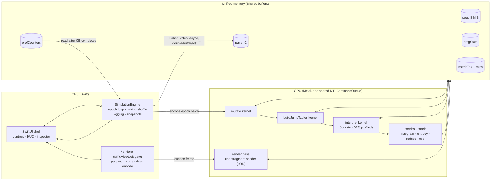

# 00 — Overview

## What we are building

A native macOS application (**SoupScope**) that runs the "BFF" computational-life experiment from
*Computational Life: How Well-formed, Self-replicating Programs Emerge from Simple Interaction*
(Agüera y Arcas et al., arXiv:2406.19108) entirely on the GPU via Metal, in realtime, with:

1. **A GPU-resident simulation** of a "soup" of 131,072 (default) 64-byte BFF programs that are
   randomly paired, concatenated, executed against each other, and mutated, epoch after epoch —
   until self-replicators emerge (the phase transition, typically after ~10³ epochs).
2. **A zoomable visualization** of the soup: zoomed out, a heatmap of per-region
   entropy/activity; zoomed in, individual bytes of individual programs rendered as color-coded
   opcodes with glyphs — one continuous pan/zoom surface, no mode switch.
3. **Embedded profiling**: counters compiled into the compute shaders (active-lane occupancy,
   steps executed, halt reasons, memory-access pattern counts) surfaced live in a HUD, so the
   running app itself tells you what is bottlenecking, and points at the matching Metal GPU
   capture counters.

Language: Swift + SwiftUI + Metal (MSL). **No external dependencies** (one optional exception:
vendoring `google/brotli` for exact parity with the paper's compression metric — see
[06-open-questions.md](06-open-questions.md); the default build uses Apple's Compression
framework instead).

## Target hardware

Apple **M4 Max, 40-core GPU, 128 GB unified memory**. Design consequences:

| Fact | Consequence |
|---|---|
| Unified memory, ~500+ GB/s | Entire soup lives permanently in one `MTLStorageModeShared` buffer; CPU reads/writes it in place between GPU passes; zero copies ever. |
| SIMD width 32 (`threadExecutionWidth`) | Lockstep interpreter: divergence and tail effects are the enemy, not ALU. All simdgroup logic assumes width 32 but queries it at startup. |
| ~32 KB threadgroup memory, 1024 max threads/threadgroup | Interpreter threadgroups of 128 threads staging 128 B tapes → 16 KB threadgroup memory, *targeting* 2 resident threadgroups/core. That headroom is a target to be verified, not a given — whether staging beats no-staging at the resulting occupancy is the #1 on-device measurement (02 §6, 06 M3). |
| 128 GB capacity | Capacity is a non-issue (default soup = 8 MiB; even 16M programs = 1 GiB). Bandwidth and divergence are the issues. |

## Scale and expected performance (estimates — verify on device)

Default configuration (matching the paper / cubff):

| Parameter | Value |
|---|---|
| Programs (N) | 131,072 = 2¹⁷ |
| Program size | 64 bytes → soup = 8 MiB |
| Pairs per epoch (P = N/2) | 65,536 |
| Combined tape | 128 bytes |
| Step budget per interaction | 8,192 |
| Mutation rate | 2²⁰/2³² per byte per epoch (= 2¹⁸/2³⁰ ≈ 1/4096); can be 0 |
| Visualization grid | 512 × 256 programs (row-major, imposed) |

Pre-transition, random programs are mostly inert data: the pc typically walks off the 128-byte
tape in O(128) steps, so an epoch is ~10–30 M lane-steps. Post-transition, replicators run long
copy loops and epochs approach the worst case of 65,536 × 8,192 ≈ 537 M lane-steps. At a
conservative 5–20 G lane-steps/s on a 40-core M4 Max, that is **thousands of epochs/s before the
transition and ~10–100 epochs/s after** — comfortably realtime, and the slowdown itself is a
visible signal of life emerging. These throughput numbers are estimates to be measured with the
embedded profiler (04).

## High-level architecture

Two loops share one `MTLCommandQueue` (hazard tracking on shared buffers serializes them
correctly):

- **Sim loop** (background thread): CPU shuffles next-epoch pairings into the idle pairs
  buffer while the GPU runs the current batch; encodes command buffers containing an adaptive
  number of epochs (target ~10 ms of GPU work each); reads back `profCounters`/`progStats`
  snapshots on command-buffer completion.
- **Render loop** (MTKView, 60/120 Hz): encodes one render pass that reads `soup` and
  `metricTex` directly. No copies; the frame shows whatever epoch the GPU most recently
  completed.

## The one design idea that everything else hangs off

The soup buffer **is** the visualization data source. There is no export, no texture upload of
program bytes: the fragment shader reads soup bytes straight out of the shared buffer at high
zoom, and samples a small GPU-reduced metric texture (entropy/activity per program, with mips)
at low zoom, crossfading between them by zoom level. Compute and render are just two views of
the same resident memory.

## Document map

| Doc | Contents |
|---|---|
| [01-bff-spec.md](01-bff-spec.md) | The BFF language and soup dynamics, implementation-precise (from Research 1 / cubff). |
| [02-gpu-execution.md](02-gpu-execution.md) | Compute kernels: lockstep interpreter, buffers, jump tables, divergence handling, v1→v2 order. |
| [03-visualization-lod.md](03-visualization-lod.md) | The zoom/LOD scheme: spatial mapping, metrics, uber-shader, palette, glyphs, interaction. |
| [04-profiling.md](04-profiling.md) | Embedded counters, accumulation, HUD, bottleneck decision tree, Metal capture mapping. |
| [05-app-architecture.md](05-app-architecture.md) | SwiftUI shell, SimulationEngine, Renderer, threading, buffer sharing, controls, logging. |
| [06-open-questions.md](06-open-questions.md) | Deferred decisions, device-verification checklist, risks, v1 milestone. |

## Naming conventions used throughout

- `N` = program count, `P = N/2` = pairs per epoch, `T = 64` = bytes/program, `2T = 128` = tape.
- Buffer names are canonical across all docs and should be the identifier names in code:
  `soup`, `pairs`, `jumpTables`, `progStats`, `profCounters`, `histogram`, `metricTex`.
- "Epoch" = one full cycle: mutate → pair → run all pairs → (periodically) metrics.
- "bytePx" = screen pixels per soup byte cell; the LOD variable (03).
