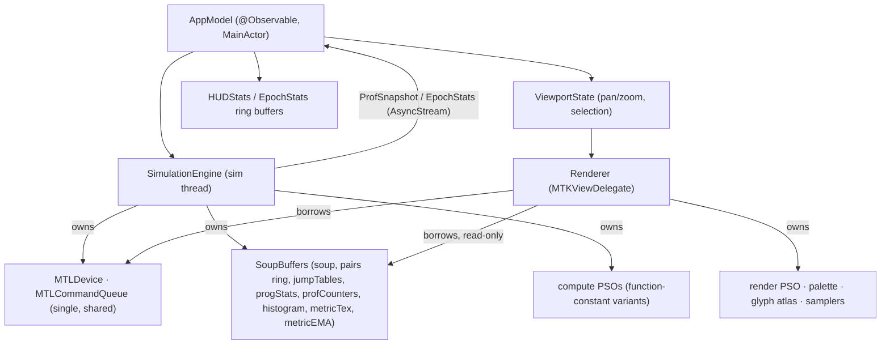

# 05 — App Architecture (Swift / SwiftUI / Metal)

Plain macOS app, **no external dependencies**. Three modules (Xcode groups; single app target
plus a headless CLI target for CI):

```
SoupScope/
  Shared/BFFShared.h          ← C header: structs + op codes (01/02/04) — single source of truth
  Shaders/*.metal             ← bff_interpret, bff_mutate, bff_build_jump_tables, metrics, soup_fragment
  SimKit/                     ← SimulationEngine, PairingGenerator, Metrics, Snapshot, CPUOracle
  RenderKit/                  ← Renderer, ViewportState, PaletteFactory, GlyphAtlasFactory
  App/                        ← SwiftUI shell, AppModel, HUD, Inspector, Controls
  Tools/soupscope-cli/        ← headless runner (SimKit only): golden tests, perf sweeps, CSV out
```

## 1. Ownership diagram



The engine **owns** all simulation resources; the renderer **borrows** a read-only view of
them via `SharedGPU` — the entire engine↔renderer contract, an actual struct, not a
convention:

```swift
/// The only thing that crosses the engine→renderer boundary. Everything in it is
/// engine-owned; the renderer treats every member as read-only (it encodes no writes to any
/// of these resources — its own writables are the drawable and its private overlay state).
public struct SharedGPU {
    public let device: MTLDevice
    public let queue: MTLCommandQueue        // the single shared queue (§4)
    public let soup: MTLBuffer               // uchar[N*64], Shared — fragment shader + inspector reads
    public let metricTex: MTLTexture         // rgba16Float 512×256 + mips — macro view
    public let progStats: MTLBuffer          // ProgStats[N], Shared — inspector/tooltip reads
    public let histogram: MTLBuffer          // uint32[256], Shared — HUD symbol-frequency strip
    public let simParams: SimParams          // value snapshot at publish time (N, gridWidth, …)
    public let generation: UInt64            // bumped by every reset(); stale-handle detector
}
```

What is deliberately *not* in it: `pairs`, `jumpTables`, `profCounters`, `metricEMA`, the
compute PSOs — the renderer has no business with them, and keeping them out makes the
read-only contract auditable at the type level. `simParams` is a **value copy**, not a
pointer, so the renderer's notion of N/gridWidth can never tear against a reset.

Buffers are never reallocated except in `reset(config:)` / `restore(from:)`, which swap in a
whole new `SharedGPU` (generation + 1) under the following quiesce handshake — the point is
that **no in-flight command buffer on either side can still reference the old buffers when
the swap happens**:

```swift
func reset(config: Config) async {
    // 1. Quiesce compute. pause() flips runState so pump() stops encoding, then suspends
    //    until the drain() of the last in-flight CB reports inflightCBs == 0 (it resumes a
    //    stored continuation). After this await, zero compute CBs reference old buffers.
    await engine.pause()

    // 2. Quiesce render (main actor). Stop new frames, then wait out the one possibly
    //    in flight: Renderer keeps `lastRenderCB`; awaiting its completion guarantees the
    //    fragment shader is done reading old soup/metricTex.
    view.isPaused = true
    await renderer.lastRenderCBCompleted()

    // 3. Swap (sim thread, synchronous — nothing else is running by construction).
    //    Allocate new buffers, reseed, build any missing PSO variants (§3), then publish.
    let gpu = engine.rebuild(config)               // new SharedGPU, generation += 1

    // 4. Re-adopt and resume. Old buffers die by ARC once the renderer drops its copy —
    //    safe, because steps 1–2 proved no GPU work references them.
    await MainActor.run { renderer.adopt(gpu); view.isPaused = false }
    engine.start()
}
```

`restore(from:)` is the same handshake with "reseed" replaced by "load snapshot". The
`generation` field is the belt-and-braces check: the renderer stamps each frame's uniforms
with it and asserts it matches its adopted struct — a mismatch means a code path skipped the
handshake.

## 2. SwiftUI shell

```
WindowGroup
└─ ContentView (HSplitView)
   ├─ ZStack
   │  ├─ SoupMetalView (NSViewRepresentable → MTKView)      ← pan/zoom gestures attach here
   │  ├─ MinimapOverlay (top-right, SwiftUI border + viewport rect; Metal draws its content)
   │  └─ HUDOverlay (bottom-left, 04 §5; monospaced, sparklines via Canvas)
   └─ Sidebar (TabView)
      ├─ ControlsPanel      (transport, parameters — §6)
      ├─ InspectorPanel     (selected program: hex+glyph dump, ProgStats, self-rep test)
      └─ ChartsPanel        (time-series: compressed size, mean steps, halt mix, lane util)
.toolbar: Run/Pause · Step ×1/×128 · Reset(seed) · speed governor · metric-channel picker
```

`SoupMetalView` configures MTKView: `colorPixelFormat = .bgra8Unorm`, no depth,
`preferredFramesPerSecond = 120`, `presentsWithTransaction = false`, delegate = `Renderer`.
Gestures (drag/magnify/scroll/click/hover via `NSEvent` local monitor for scroll-wheel zoom)
mutate `ViewportState` on the main actor; the renderer reads it each frame — no locking, it's
a value snapshot.

Charts in `ChartsPanel` use SwiftUI `Canvas`/`Path` line charts over the `EpochStats` ring
buffers (no Swift Charts dependency needed at this fidelity; Swift Charts is system-provided
and acceptable if nicer axes are wanted — implementer's choice).

## 3. SimulationEngine

```swift
public final class SimulationEngine: @unchecked Sendable {
    public struct Config: Codable, Equatable {
        var soupProgs: Int = 131_072        // power of two ≥ 512
        var pairsPerEpoch: Int { soupProgs / 2 }   // P, used by the batcher's stepCap (§4.1)
        var seed: UInt32 = 0xB00F
        var stepBudget: Int = 8192
        var mutationP32: UInt32 = 1 << 20   // 0 = off
        var pairing: Pairing = .wellMixed   // .spatial(radius: Int)
        var variant: Variant = .noheads     // .heads
        var brackets: Brackets = .jumpTable // .dynamicScan
        var stageTapes: Bool = true         // kStageTapes A/B
        var profileLevel: Int = 1
        var metricsEvery: Int = 128
    }

    public private(set) var epoch: UInt64
    public var runState: RunState          // .paused / .running / .stepping(remaining: Int)
    public let stats: AsyncStream<EpochStats>      // consumed by AppModel on MainActor

    public func start()                     // resumes sim thread loop
    public func pause() async               // returns after in-flight CBs complete
    public func step(epochs: Int)
    public func reset(config: Config) async // quiesce handshake (§1), then synchronous
                                            // reseed + reallocate; publishes new SharedGPU
    public func setLive(_ p: LiveParams)    // mutation rate, profile level, EMA α — no reset
    public func snapshot(to url: URL) async throws
    public func restore(from url: URL) async throws // same quiesce handshake as reset (§1)
    public func requestSelfRepCheck(program: Int) async -> SelfRepResult   // 01 §5
}
```

Internals:

- **Sim thread**: one serial `DispatchQueue` (`.userInitiated`). All Metal *encoding* for
  compute happens here; all engine mutable state is confined here (public API hops onto it).
- **PSO variants**: `bff_interpret` has three function-constant axes — staging (2) × brackets
  (2) × profileLevel (3) = **12 possible combinations** (02 §6). We do *not* prebuild all 12.
  The rule: **an axis is live-switchable via `setLive()` iff its PSOs are prebuilt and
  resident; axes routed through `reset()` may compile on demand.**
  - **Prebuilt at init (resident, zero-cost to switch): exactly 3** — profileLevel
    {0, 1, 2} × the config's current (staging, brackets). Reason: profile level is the one
    interpret axis that must flip mid-run (HUD toggle, and the calibrate action's level-0 ↔
    current comparison, 04 §1).
  - **Built on demand at `reset()` (cached forever after; ≤ 12 interpret PSOs ever exist):**
    the other three (staging, brackets) combinations, each pulling in its 3 levels when first
    selected. Reason: staging and brackets already require `reset()` semantically — brackets
    changes the trajectory (01 §7.3), and A/B perf comparisons are only meaningful as
    same-seed fresh runs — so a one-time ~10 ms PSO compile inside an already-destructive
    reset is invisible.
  - Plus the **fixed PSOs**, always prebuilt: mutate, buildJumpTables, programMetrics,
    histogram, and the render PSO. Compile failures of the init-time set are fatal at init
    (assert with the Metal error), not runtime surprises; on-demand compiles fail the reset
    with a visible error.
- **PairingGenerator**: owns the 8-slot pairing ring (02 §2). A background task keeps ≥ 4
  slots filled: Fisher–Yates over `0..<N` using the Swift mirror of `rng3(seed, epoch·4+1, ·)`
  (01 §6), writing straight into the Shared slot buffer. Slots are recycled by CB completion
  handlers. Spatial mode swaps the fill function (random local perfect matching, 01 §4) — the
  ring mechanics are identical.

## 4. The run loop (the heart)

```swift
// on sim thread, while runState == .running
func pump() {
    guard inflightCBs < 2 else { return }                  // wait for a completion callback
    let E = batcher.epochsForTarget(ms: 10, cap: pairing.slotsAvailable(),
                                    stepCap: cfg.pairsPerEpoch)   // §4.1: keeps Σsteps < 2³¹
    guard E > 0 else { schedulePairingRefillThenPump(); return }

    let cb = queue.makeCommandBuffer()!
    for _ in 0..<E {
        encodeMutate(cb)          // skipped if mutationP32 == 0
        encodeJumpTables(cb)      // skipped in dynamicScan mode
        encodeInterpret(cb)       // params via setBytes(SimParams) — no ring needed
        epochCursor += 1
    }
    encodeProgramMetrics(cb); encodeMipGen(cb)             // once per CB (02 §3)
    if epochCursor.isMultiple(of: cfg.metricsEvery) { encodeHistogram(cb) }
    attachTimestampSampling(cb)                            // 04 §6
    cb.addCompletedHandler { [self] cb in simQueue.async { self.drain(cb, epochs: E) } }
    inflightCBs += 1
    cb.commit()
    pump()                                                  // try to keep 2 in flight
}

func drain(_ cb: MTLCommandBuffer, epochs: Int) {
    inflightCBs -= 1
    let window = profTotals.absorbAndZero(profCountersPtr) // Shared: direct pointer read
    batcher.record(gpuMs: (cb.gpuEndTime - cb.gpuStartTime) * 1000,
                   epochs: epochs,
                   totalSteps: window.totalSteps, pairsDone: window.pairsDone)  // §4.1
    epoch += UInt64(epochs)
    publishEpochStats(gpuTime: cb.gpuEndTime - cb.gpuStartTime)
    pairing.recycle(consumed: epochs)
    maybeKickCompressionMetric()                           // §7
    if runState == .running { pump() }
}
```

Decisions and reasons:

- **Adaptive batching** (`batcher`, fully specified in §4.1): EMA of GPU-time-per-epoch →
  epochs per CB targeting ~10 ms. Pre-transition that's ~100 epochs/CB (the overflow cap
  binds before the time target); post-transition ~1. Caps: pairing-ring headroom and the
  2³¹-steps counter bound.
- **≤ 2 CBs in flight**: keeps the GPU fed without letting the HUD/render lag the sim by more
  than ~20 ms, and bounds how stale the drained counters are.
- **One shared `MTLCommandQueue`** for compute and render. Metal's automatic hazard tracking
  on `soup`/`metricTex` orders the render pass against whole compute CBs. Consequence: a
  frame may wait up to one CB (~10 ms) — invisible at 60 Hz, marginal at 120 Hz. This is the
  simple-and-correct v1 choice; untracked resources + explicit fences are the escape hatch if
  profiling shows render stalls (04 §7 item 1; 06 D6/R4). Escape-hatch procedure, so D6 is
  actionable when the evidence arrives:
  1. Allocate **only** `soup` and `metricTex` with `.hazardTrackingModeUntracked`; every
     other buffer stays tracked (their hazards are compute-internal and cheap).
  2. Compute side: encode each epoch's kernels in **one** `MTLComputeCommandEncoder`,
     separating dispatches with `memoryBarrier(scope: .buffers)` (replaces the intra-CB
     tracking we just turned off); the CB's final encoder (programMetrics/mips) calls
     `updateFence(simFence)` — one `MTLFence` created at init.
  3. Render side: the render encoder calls `waitForFence(simFence, before: .fragment)` —
     the frame reads the last *fenced* state instead of queue-serializing against the whole
     in-flight compute CB. Compute never reads render output, so no reverse fence exists.
  4. CPU reads of `soup` (compression metric, inspector) keep using CB-completion boundaries
     exactly as today — the fence change affects only GPU↔GPU ordering.
- `SimParams` per epoch via `setBytes` (~40 B, inlined into the CB) — no params ring buffer,
  no lifetime headaches.

### 4.1 The adaptive batcher (specified)

The batcher answers one question per `pump()`: *how many epochs E may this command buffer
encode?* It is the min of four terms — a time target, a counter-overflow cap, the pairing-ring
headroom, and a ramp limit — with constants chosen conservatively because the failure mode of
over-batching (a 100 ms+ CB that also overflows the 32-bit profiling counters) is worse than
the failure mode of under-batching (slightly more drain overhead, which is ~µs).

```swift
struct AdaptiveBatcher {
    // --- constants (rationale below)
    static let alpha        = 0.2      // EMA weight for the newest GPU-time-per-epoch sample
    static let eFloor       = 1        // never encode less than one epoch
    static let eCeil        = 1024     // absolute ceiling; also bounds worst-case CB length
    static let rampFactor   = 4        // E may at most quadruple from one CB to the next
    static let safety       = 2.0      // step predictor multiplier
    static let growthGuard  = 1.5      // mean-steps growth ratio that triggers worst-case mode
    static let budget       = 8192.0   // absolute worst-case mean steps (the step budget)

    private var emaMsPerEpoch: Double? = nil   // nil = no history yet (cold start)
    private var lastMeanSteps = 8192.0         // worst case until the first drain says otherwise
    private var prevMeanSteps = 8192.0
    private var lastE = 1

    /// Called from drain() with the completed CB's measured GPU time and its counters.
    mutating func record(gpuMs: Double, epochs: Int, totalSteps: UInt64, pairsDone: UInt64) {
        let sample = gpuMs / Double(epochs)
        emaMsPerEpoch = emaMsPerEpoch.map { Self.alpha * sample + (1 - Self.alpha) * $0 }
                        ?? sample                       // first drain seeds the EMA directly
        prevMeanSteps = lastMeanSteps
        lastMeanSteps = Double(totalSteps) / Double(pairsDone)
    }

    /// ms: GPU-time target (~10). cap: pairing slots available. stepCap: P = pairs/epoch.
    mutating func epochsForTarget(ms target: Double, cap slots: Int, stepCap P: Int) -> Int {
        // 1. TIME term. Cold start (no EMA yet): E = 1 — one conservative probe CB whose
        //    measured time seeds the EMA; the ramp limit then grows E over the next few CBs.
        let eTime = emaMsPerEpoch.map { max(1, Int(target / $0)) } ?? 1

        // 2. OVERFLOW term — the hard one. ProfCounters are 32-bit and drained per CB
        //    (04 §2); the binding counter is totalSteps (activeLaneSteps ≡ totalSteps, all
        //    others are smaller). Invariant: E · predictedMeanSteps · P < 2³¹.
        //    The predictor MUST be adaptive: post-transition mean steps (> 4096) is ~10×
        //    pre-transition (~130 — the pc walks off a 128-byte tape of mostly no-ops), so
        //    any static value is either unsafe or wastes 10× of batching.
        //      predicted = min(8192, safety × lastDrainMean)      — safety ≥ 2
        //    Transition guard: replicator takeover grows the mean exponentially, and a ×2
        //    safety margin cannot cover a mid-batch 10× jump. If the last drain's mean grew
        //    > 1.5× over the previous drain, assume the worst case (8192) until growth
        //    flattens. Cold start also uses 8192 (no history ⇒ assume worst).
        let growing   = lastMeanSteps > Self.growthGuard * prevMeanSteps
        let predicted = (emaMsPerEpoch == nil || growing)
                      ? Self.budget
                      : min(Self.budget, Self.safety * lastMeanSteps)
        let eSteps = max(1, Int((Double(1 << 31) - 1) / (predicted * Double(P))))

        // 3. RAMP + bounds. Quadrupling per CB reaches eCeil from 1 in five CBs (~50 ms)
        //    while keeping any single misprediction's overshoot bounded.
        let E = min(eTime, eSteps, slots, Self.rampFactor * lastE, Self.eCeil)
        lastE = max(Self.eFloor, E)
        return lastE
    }
}
```

Worked numbers (defaults, P = 65,536): pre-transition `lastMeanSteps ≈ 130` → predicted 260 →
`eSteps = ⌊(2³¹−1)/(260·65536)⌋ ≈ 126`, so the overflow cap (not the 10 ms target) typically
binds and a CB is ~100+ epochs / a few ms — under-filling the time target is accepted, since
more frequent drains only cost microseconds and keep the predictor fresh. Post-transition
`lastMeanSteps → 8192` → predicted 8192 → `eSteps = 4`, and the time term (~10–100 ms/epoch)
binds first at E = 1. Residual risk — a batch that *straddles* the transition onset faster
than the guard reacts — corrupts at most one HUD window and nothing else (counters never feed
simulation, 01 §6); see 06 R7.

## 5. Renderer

```swift
final class Renderer: NSObject, MTKViewDelegate {
    init(gpu: SharedGPU, viewport: ViewportState)  // borrows the read-only SharedGPU view (§1)
    func adopt(_ gpu: SharedGPU)                   // reset/restore handshake step 4 (§1)
    func draw(in view: MTKView) {
        viewport.tick()                             // spring animation step (03 §8)
        var u = viewport.makeUniforms(drawable: view.drawableSize,
                                      channel: appModel.metricChannel,
                                      selected: appModel.selectedProgram)
        // one render CB: main view draw + minimap draw (same PSO, second VizUniforms)
    }
}
```

Stateless per frame apart from the animation spring; misses nothing if the sim outpaces it
(it always renders the latest completed state — 00's "two views of resident memory"). Palette
LUT and glyph atlas are built once by `PaletteFactory` / `GlyphAtlasFactory` (CoreText → CGContext
→ `MTLTexture`, 03 §5–6).

## 6. Controls → engine mapping

| Control | Path | Notes |
|---|---|---|
| Run / Pause / Step ×1 / ×128 | `start/pause/step` | Step encodes exactly n epochs then pauses (single-CB) |
| Speed governor | batcher target (`max` / capped epochs/s) | capped mode inserts sim-thread sleeps, GPU stays cool for long unattended runs |
| Mutation rate (log slider, off–1/256) | `setLive` | takes effect next CB |
| Soup size N, seed, variant, pairing, brackets, staging | `reset(config:)` | destructive; confirm dialog when a run is live. Brackets/staging PSOs may compile on demand here (§3) |
| Metric channel / EMA α / sorted lens / profile level | `setLive` + `VizUniforms` | zero-cost switches — profile level via the 3 prebuilt PSOs (§3); the rest are shader uniforms / `SimParams.emaAlpha`. These are the **only** zero-cost axes |
| Snapshot save/load | `snapshot/restore` | §7 format |
| CSV logging toggle | `MetricsLogger` | §7 |

## 7. Inspection, metrics, logging, persistence

- **EpochStats** (published per drain): epoch, wall time, GPU time, epochs/s, lane-steps/s,
  mean steps, halt mix, copy rate, lane util, tail ratio, pass-time split. Ring-buffered
  (~4 K entries) in `AppModel` for charts; optionally appended as JSONL/CSV
  (`~/Documents/SoupScope/runs/<timestamp>-<seed>/metrics.csv`).
- **Compression metric** (01 §5): every `metricsEvery` epochs, at a drain boundary while no
  compute CB is in flight (briefly hold `pump()`), `memcpy` the 8 MiB soup (≈1 ms) and
  compress on a utility task using the **Compression framework** (`COMPRESSION_ZLIB`; Apple's
  libcompression has no Brotli — parity option is vendoring google/brotli, 06). Result joins
  EpochStats late (charts tolerate sparse series).
- **Inspector**: selection from 03 §8; reads `soup`/`progStats` pointers directly (Shared,
  64 B + 8 B — tearing is impossible at that size ~within one cache line, and reads happen at
  drain boundaries anyway). Renders hex + glyph + colored strip; "Test self-replication"
  calls `requestSelfRepCheck` (small GPU batch, 01 §5).
- **Snapshot format** (`.bffsoup`): little-endian header
  `{magic 'BFF1', version, configJSON length+bytes, epoch, N}` + raw soup bytes (+ optional
  progStats block). Because all RNG streams are keyed by `(seed, epoch, index)` (01 §6),
  restore + run reproduces the original trajectory exactly.
- **Headless CLI** (`soupscope-cli run --seed 7 --epochs 20000 --csv out.csv`): same SimKit,
  no UI — used for the golden-run regression (02 §10) and perf sweeps on CI/device.

## 8. Testing strategy

1. **CPUOracle** (v0, 02 §10): scalar Swift interpreter, both bracket modes + remap-event
   counter, `cubffCompat` mode; property tests (bracket edge cases, wrap semantics, budget).
   **Grounding gate (v0.5)**: reproduces the cubff golden vectors bit-identically (01 §7.1) —
   run once, vectors and result checked into the repo.
2. **GPU↔oracle diff** (01 §7.2): 10⁴ random pairs, both bracket modes, both variants →
   identical tapes/steps/halt; plus epoch-trajectory soup hashes at {1, 128, 1024}. Re-run
   after every kernel optimization.
3. **Golden run**: fixed seed, 20 K epochs headless → assert phase transition occurs
   (compressed size drop > 40 %, mean steps > 4096) within an epoch window; catches both
   correctness and RNG regressions.
4. **Determinism**: same seed twice → identical soup hash at epoch 10 K; snapshot/restore
   mid-run → identical continuation.
5. Renderer smoke test: offscreen draw at 4 zoom levels, golden-image compare (loose
   tolerance).
